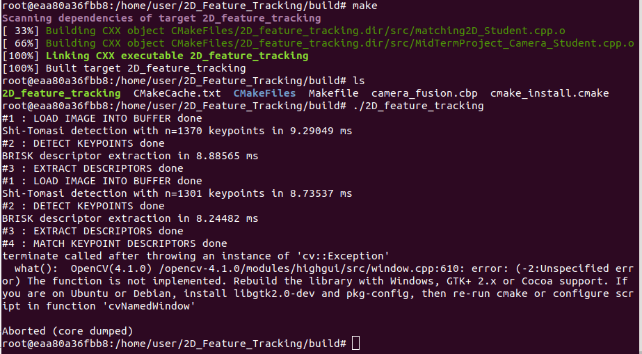
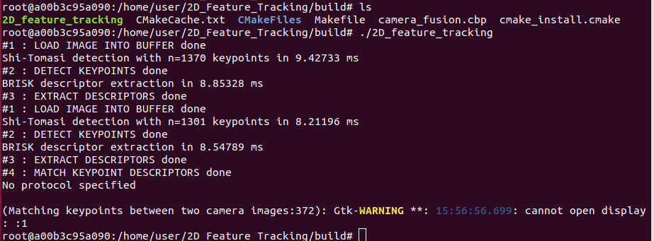
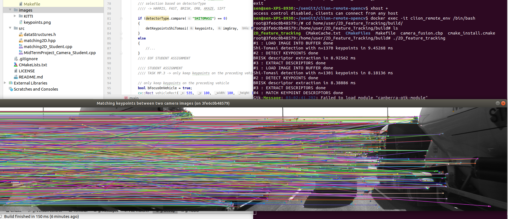
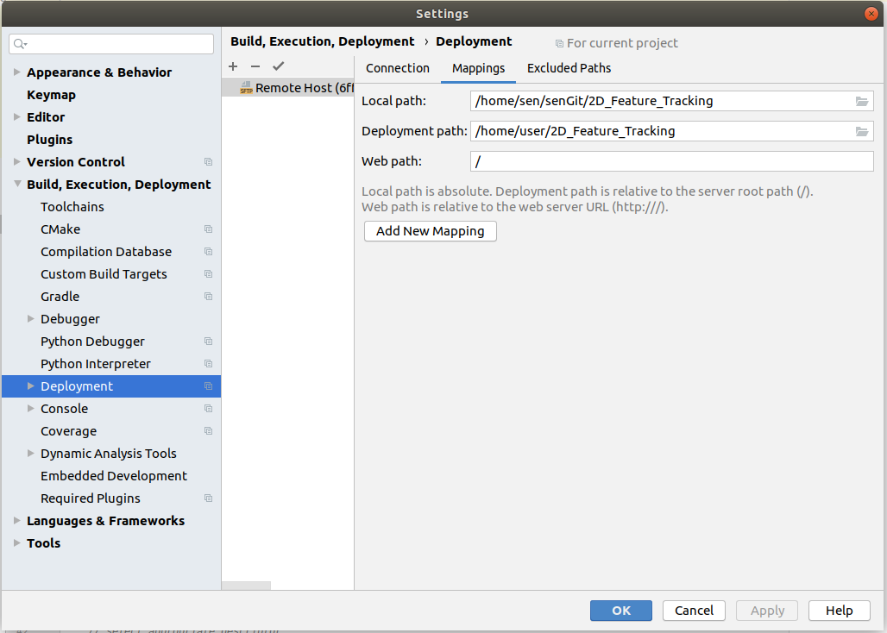

- clionのremote modeでやるとき、いつも`cv::nameWindow()`でSIGABRTエラーが出ている。多分GUIを使えていない。

- 直接にdocker container内で実行しても同じエラー：

- `libgtk2.0-dev`や`pkg-config`をインストールしよう！

- インストールしたが、`Gtk-WARNING: cannot open display`のエラー：

- `xhost +`でできたが、clionでは相変わらずできない。今後解決しよう。

- 下記の３ステップで実行している。

  ```bash
  docker run -d --cap-add sys_ptrace -p 2222:22 --name clion_remote_env -e DISPLAY=$DISPLAY -v /tmp/.X11-unix:/tmp/.X11-unix clion/remote-cpp-env:0.5
  
  xhost +
  
  docker exec -it clion_remote_env /bin/bash
  
  # cmake, make, 実行, exit
  
  xhost -
  ```

  - コードのマッピングはclionで設定しているので、containerをrunするときは指定していない（下記のマッピングはdocker run時指定してみたが、clionのdata transferと衝突したかもしれない、コードは全部消された）：

- なので、今のやり方は、clionがeditor + file transfererを担当している。exec bashはmake (clionでもOK) + 実行を担当している。